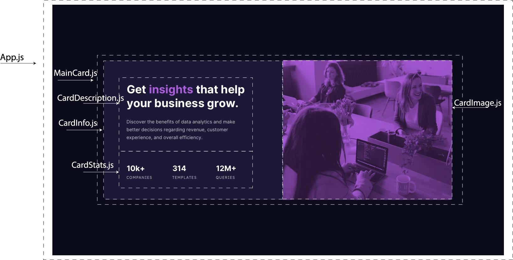

# Frontend Mentor - Stats preview card component solution

This is a solution to the [Stats preview card component challenge on Frontend Mentor](https://www.frontendmentor.io/challenges/stats-preview-card-component-8JqbgoU62). Frontend Mentor challenges help you improve your coding skills by building realistic projects. 

## Table of contents

- [Overview](#overview)
  - [The challenge](#the-challenge)
  - [Screenshot](#screenshot)
  - [Links](#links)
- [My process](#my-process)
  - [Built with](#built-with)
  - [What I learned](#what-i-learned)
  - [Continued development](#continued-development)
- [Author](#author)

## Overview

- Create a simple, responsive UI for a card component in React.

### The challenge

Users should be able to:

- View the optimal layout depending on their device's screen size

### Screenshot
PLANNING

DESKTOP

MOBILE


### Links

- Solution URL: [FrontEndMentor Solution](https://your-solution-url.com)
- Live Site URL: [Live Site](https://competent-swartz-0ed9a1.netlify.app/)

## My process

- Broke down design into components
- Created component file structure
- Added content to components
- Styled for desktop
- Styled for mobile

### Built with

- Semantic HTML5 markup
- CSS custom properties
- Flexbox
- [React](https://reactjs.org/) - JS library

### What I learned

- Adding various filter functions to create a custom filter. In this case, giving an image a pink/magenta hue.
```css
.card-main-img {
  filter: brightness(35%) sepia(100%) hue-rotate(-130deg) saturate(600%) contrast(0.80);
}
```
- Using Flexbox to change shift elements around based on screen size
```css
@media only screen and (max-width: 600px) {
  .card-main {
    display: flex;
    flex-direction: column-reverse;
  }
}
```
- Individually adding border-radius to different corners
```css
.card-main-img {
  border-radius: 10px 10px 0px 0px;
}
```
### Continued development

- Using semantic-ui or material-ui to build styled components
- Using Vue or Angular to build card component

## Author

- Website - [Adrian Salinas](https://www.adriansalinas.tech)
- Frontend Mentor - [@a-dri-an-S](https://www.frontendmentor.io/profile/a-dri-an-S)
